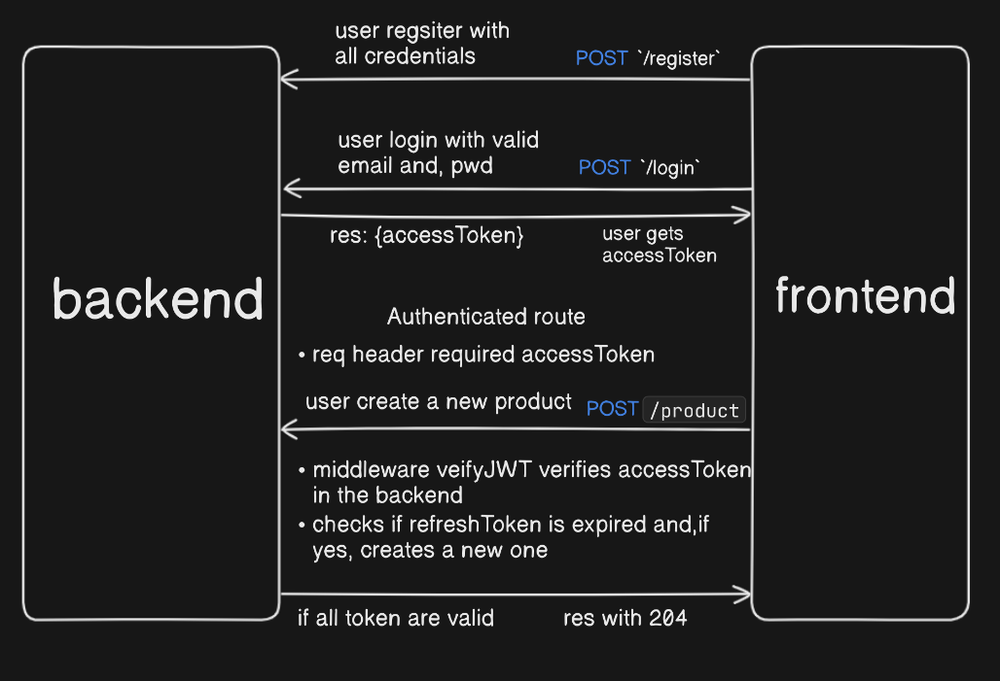

#### Tathya Fullstack Ecommerce App v2
A basic ecommerce app but, with a lot of hope 😅

### Tech Stack Used (PERN Stack)
- React
- TailwindCSS
- Node
- ExpressJS
- PostgreSQL
- Prisma ORM

### Blogs:
[1. Token Authentication in a SPA App : Recommendation](https://medium.com/lightrail/getting-token-authentication-right-in-a-stateless-single-page-application-57d0c6474e3)

[2. How To Validate a JWT Token](https://medium.com/dataseries/public-claims-and-how-to-validate-a-jwt-1d6c81823826)

[3. Mutation in React Query](https://tkdodo.eu/blog/mastering-mutations-in-react-query)

[4. Separate API Layers in react](https://profy.dev/article/react-architecture-api-layer)

[5. Error Handling in Express](https://www.turing.com/kb/how-to-master-express-js-error-handling)

[6. Uploadthing working as a wrapper for S3: Illustration](https://github.com/pingdotgg/uploadthing/blob/main/assets/Diagram.png)

[7.How to push Docker Postgres image with persistent data?] (https://seration.medium.com/how-to-push-docker-postgres-image-with-persistent-data-777783df09cb)

### Developing feature by feature from backend to frontend (Also, product flow or, say, user story.)
#### Customer end:
1. Authentication with JWT
- User register with required credentials and, get redirected to login page. Once the login is done, than the user is redirected to home page to browse products and, product details. 
- Roles based authentication.
2. Products with filter and, search.
- User are alllowed to CRUD Products. 
-  In products, user can use filter and, search using categories, prices and, sizes filters.
- For better UX, lazy loading and, optimistic rendering is needed. 
        + Product detail layout with filters
        
3. Cart and, orders
- Users browse through products and, add items to the cart. User can actively choose the products to add to cart from the products listing and, through product description. User can remove or, add product so as the quantity of the products. 

##### Out of scope for now. 
- We can implement newsletter such as if the cart is stale for a while using a timer which awares to take action which varies but, optmistic to make users engage more in the website by giving discounts and, making stuffs more lucrative.  
- We can add recommendation engines to recommend the products using our products stats and, categorizing users on the basis of the buying behaviour. 
- We can purposefully implement a blockchain based review system to review the products while user being annonymous to have a blueprint of how product performed over years. And, to which we can have a more open community of users who discussed to improve the products and, create a healthy environment. 
- We can use the payment integration and, package detection methods to improvise users experience.x

#### Employers end
1. Product management
2. Order managment
- Admin can view all the orders and, can use filter to look through the products as the recent one, or, through status such as pending, success and, so on. 
3. Dashboard

### Just JWT stuff

